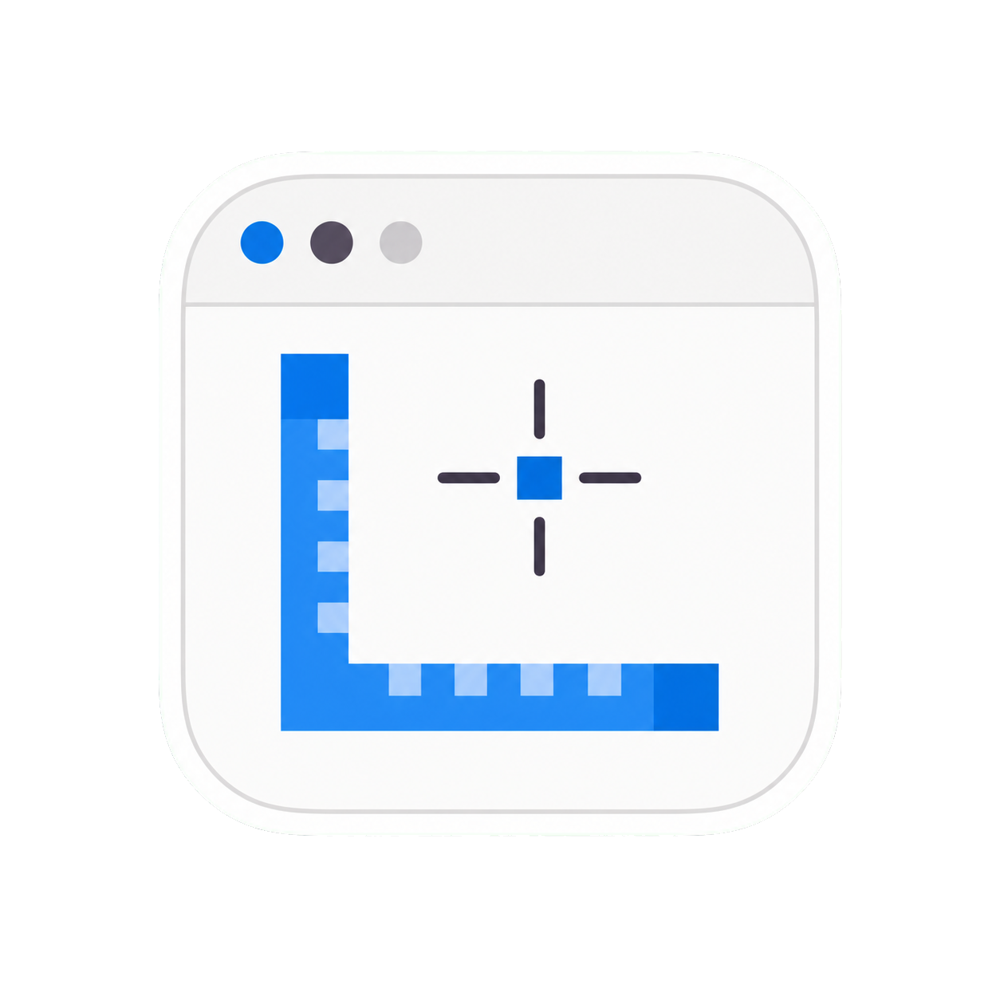

# PixelRuller



AI collaborators should read [`AI_SKILL.md`](AI_SKILL.md) before creating, editing, or implementing a PixelRuller UI design.

Current release: **v0.0.2**

A pixel-measuring tool for counting screen distances, positions, and areas.
It grabs a full screenshot, overlays a ruler grid, and lets you drop points or
draw measured line/area shapes on top — AutoCAD-style crosshair included.

Built for **KDE Plasma on Wayland (Ubuntu)** with **zero dependencies**: a tiny
Python-stdlib server captures the screen with `spectacle` and saves images; all
the interactive measuring happens on an HTML canvas in your browser.

## See it in action

### Point out anything with exact measurements


### Design an interface from scratch


### Human and AI co-design the same interface


### Proof of concept: PDFExtractor redesign

The responsive [`PDFExtractorUI.json`](web/PDFExtractorUI.json) design is the
first complete proof of concept for the PixelRuller workflow. A human can edit
the interface visually, while an AI reads the same hierarchy, percentage sizing,
spacing, and styles to reproduce the application in real code. The redesign is
based on the real [PDFExtractor project](https://github.com/kalotrapezis/PDFextract).
Its window has a safe 1000×700 minimum, so the desktop UI stops shrinking before
the document/settings columns and action bar become unusable.

## Run

```bash
./run.sh            # start the app and open it in the browser
./run.sh --grid     # capture immediately and show the pixel-counting grid
```

Check the installed or source version with:

```bash
./run.sh --version
```

## Install the Debian package

Download `pixelruller_0.0.2_all.deb` from the GitHub release and install it with:

```bash
sudo apt install ./pixelruller_0.0.2_all.deb
```

Then launch **PixelRuller** from the application menu or run `pixelruller` in a
terminal. Build the package locally with `packaging/build-deb.sh`; the result is
written to `dist/`.

Spectacle is optional at package-install time. Canvas design, JSON loading, AI
co-design, and code export work without it; only desktop screenshot capture
requires Spectacle to be available in the graphical session.

The package installs `/usr/bin/pixelruller`, so the command is system-wide after
installation. Root is not required to run it. An AI needs browser-control access
to operate the live editor, but can always print the complete platform-neutral
usage guide with `pixelruller --print-ai-skill`.

On launch you pick a **start mode**:

- **📸 Screenshot** — capture the desktop to measure or redline over.
- **🎨 New canvas** — start an empty design canvas at a size you choose.
- **📂 Load a design.json** — reopen a previously saved design.

Use the **timer** dropdown next to Capture (3s / 5s / 10s) to delay a shot — a
full-screen countdown gives you time to open a menu or hover a tooltip first.
The **🆕 New** button reopens the start chooser at any time. Annotated images are
saved to `~/Εικόνες/PixelRuller/` (your Pictures folder + `PixelRuller`).

## Bind a keyboard shortcut (KDE)

To "call a grid screenshot with a command":
*System Settings → Keyboard → Shortcuts → Add Command* and point it at:

```bash
/path/to/PixelRuller/run.sh --grid
```

## Using it

The tools shown depend on the mode. **Screenshot mode** (measuring/pointing) has
Point/Area; **canvas mode** (designing) has the shape tools and hides the
pointing tools.

### Screenshot mode — point things out, get numbers

- **Point mode** — click anywhere to drop a marker showing its `(x, y)` pixel.
- **Area mode** — click to chain points into measured line segments; each
  segment shows its length in px and each vertex its position. Click the first
  point again, press **Enter**, or double-click to close the area (closed areas
  also show the enclosed area in px²). **Right-click removes the last point**
  while you're drawing.
- **☝ Select mode** — point at any shape and click to select it (dashed
  highlight). The Name / Label / Color boxes then edit **that** shape, so each
  area gets its own name. Press **Delete** to remove the selected shape.
- **Snap** — `Off` / `90°` (orthogonal) / `45°` constrains each new segment
  relative to the previous point. **points** additionally snaps the cursor onto
  existing corners/points (yellow ring shows the target) — great for closing
  shapes or continuing from an earlier vertex. **= length** forces every new
  segment to the length of the first one you drew.
- **Typed distance** — while drawing an area, just type a number (e.g. `150`)
  and press **Enter**: the next point is placed exactly that many pixels along
  the direction you're aiming. Backspace edits, Esc cancels.
- **≡ Equalize** — select an area (☝ Select mode) and click Equalize: all its
  segments are rebuilt to the same (average) length, near-axis sides are
  straightened, and closed shapes still close exactly — a 19/21/20/18 px
  "rectangle" becomes a clean 20/20/20/20.

### Canvas mode — place named elements to design

- **▭ Rect / ◯ Ellipse** (keys `R` / `E`) — drag on the canvas to create a
  shape. It's auto-named (`Rectangle 1`, `Ellipse 1`…) and given the toolbar's
  fill, stroke, and corner-radius. After drawing, it's selected so you can name
  it or move it.
- **☝ Select** (`S`) — click an element to select it; Shift-click adds/removes
  elements and dragging empty space makes a marquee selection. Select never
  moves, reparents or reorders a widget. Its resize handles can resize one
  selected item. `Delete` removes the selection.
- **✋ Move** (`M`) — the only tool that moves layout objects. Drag a widget to
  another container/slot. On release it becomes
  a managed child and follows the target layout. For deliberate absolute
  positioning, explicitly enable **Fixed** in Properties.
- **📷 Camera** (`C`) — drag anywhere to pan the view without selecting or
  modifying the design. Space-drag and middle-drag are temporary Camera
  shortcuts in every mode and are consumed before object hit-testing.
  - **▣ Group** (`Ctrl+G`) wraps the selected elements in a Section;
    **▢ Ungroup** (`Ctrl+Shift+G`) removes a selected Section, keeping its
    contents.
- **Ctrl+Click or right-click** an element — opens a floating **properties
  panel** (single column) organized into collapsible sections (click a section
  header to fold it):
  - **Position & size** — X, Y, W, H, **Depth** (z-order, with **▲ Front** /
    **▼ Back**), and a **Fixed position** toggle (📌 on its label).
  - **Appearance** — Filled on/off, Fill & Stroke colors, Border-width slider,
    Radius slider, **Opacity** slider (make an element transparent).
  - **Spacing** — Margin and Padding.
  - **State** (stateful widgets only) — a checkbox's/radio's **Checked**, a
    toggle's **On**, or a slider's/progress's **Value**.
  - **Layout** (Sections & Windows only) — vertical / horizontal / table +
    align, and an **Arrange children** button that positions the contained
    elements accordingly.
  - **Text** — the visible text, Font-size slider, **Align H / V** (title/text
    placement), and text color.
  - **Name** — the element's name.

  Editing any control updates the element instantly, and values stay live while
  you drag/resize. Drag the panel header to move it; ✕ or `Esc` closes it.
- In **creation mode** the **Grid** and **Show numbers** controls live in a
  **bottom bar** (the top toolbar keeps New / tools / element / Save / JSON /
  Load). In screenshot mode they stay on the top toolbar.
- **Library panel** (right side, creation mode) — two categories:
  - **Icons** — the SVGs in `Assets/SVGs/`. Click one to drop it as an **icon
    element** (named from the filename). Search box filters; `⟩`/`⟨` collapses.
  - **Widgets** — real UI widgets in collapsible categories **Sections / Input /
    Navigation / Output / Backend** (including editable window/title/status/path
    bars, menus, toolbars, tabs, search, split panes, spacers and window controls)
    with
    **GTK 4 / KDE** toolkit tabs. Clicking inserts the widget with that toolkit's
    default size/radius (from `libraries.md`), rendered as a proper control.
    Use the Library search box to filter widgets by name; **Sections** and
    **Input** and **Navigation** stay expanded by default so Button and the
    structural/chrome widgets are immediately visible.
  - **SVGs inside widgets** — select a Button, Tool button, Menu item, or Textbox
    and open **Icon / SVG** in Properties. Choose any asset from `Assets/SVGs/`,
    then set its size, gap, and placement. **Icon only** keeps the widget's fill
    and border but hides its text, which is suitable for hamburger/icon buttons.
  All inserted items are normal elements — selectable/movable/resizable, editable
  via the properties panel, and round-tripped through `design.json`.
- A new blank canvas opens with a default **Window named "Session"** (PC apps
  have windows, not phone screens — analogous to Android activities).
- The floating **＋** opens an **Add window** chooser. Create a new empty GTK/KDE
  window, or duplicate any existing window with its complete widget tree. Give
  the copy another width/height to test a compact, regular, wide, loading, error,
  or complete stage. Every root stays visible on the same canvas so a human and
  AI can compare all sizes/states together.
- **Copy / Cut / Paste / Duplicate / Delete** — `Ctrl+C` / `X` / `V` / `D` and
  `Del` on the selected element (paste is offset and auto-renamed). In creation
  mode the tool + edit buttons (Select/Rect/Ellipse, Copy/Cut/Paste/Delete/Undo/
  Clear, Grid, Show) live in the **bottom bar**; the top toolbar keeps file ops.
- **Windows** use editable chrome widget trees. GTK uses the minimal GNOME
  structure from `presets/GTK-Start.xml`: one titlebar with navigation/new-tab,
  centred title, hamburger and window controls, then the body. KDE keeps its
  separate titlebar, menubar, toolbar and content rows; its toolbar ends with a
  flexible spacer, Search field and Hamburger as defined by
  `presets/KDE-Window.xml`. Tabs can be activated by clicking them directly on
  the canvas.
- **Sections are layout containers** — set a Section's Layout (vertical /
  horizontal / table) + align, then **Arrange children** to auto-position the
  widgets inside it. Fixed/fill/hug/percentage sizing, grow weights, wrapping,
  min/max bounds, padding, margins and gaps all remain part of the design data.
- **▤ Flow** — exports a plain-text outline of the design (each Window and the
  widgets inside it, by position) to a `_flow.txt` in the `PixelRuller` folder —
  the start of the flow-chart output.
- **&lt;/&gt; XML** — exports the design as a nested XML tree
  (`canvas > window > widget`) including layout and sizing properties.
- **&lt;/&gt; Code** — exports one runnable, self-contained HTML file. The widget
  parent/slot tree becomes nested DOM; layout/sizing/style/state become CSS and
  native controls; referenced assets are embedded. Only explicit **Fixed** mode
  generates absolute positioning. JSON remains the canonical editable format.
- The current **zoom %** shows at the bottom-left of the canvas.
- A **Window** is a root parent. The final root cannot be deleted, and a new
  canvas starts with one; additional application windows and responsive/state
  variants may be added and removed.
- **Name / Text / Stroke / Fill / r** — with an element selected, the Name box
  renames it, the second box sets its **visible text** (e.g. a button label),
  and the two color pickers + `r` set stroke, fill, and corner roundness. Every
  element always has a name and an exact position/size — nothing to "point at".
- Shared with screenshot mode: **Grid**, **Show numbers**, **Save** (PNG),
  **{ } JSON** / **📂 Load**.

Common to both modes:

- **Show numbers** — toggle the coordinate / length / area labels on committed
  shapes. When off, boxes and points stay but the text is hidden (an area keeps
  its name). This also controls what gets burned into saved images.
- **Grid** — toggle the ruler grid and set its spacing; numbers along the top
  and left edges let you count pixels by eye.
- **Name / Label / Color** — name an area, add a label, and pick the border
  color before drawing (or before saving).
- **💾 Save** — writes the annotated image (at true screen resolution) to the
  `PixelRuller` folder. Tick **auto-save areas** to save automatically whenever
  you finish an area.
- **{ } JSON** — writes the whole design as a canonical JSON document (canvas
  size, grid, and every shape: corners, names, labels, colors, per-segment
  lengths, perimeters, areas, bounding boxes) to the `PixelRuller` folder. This
  is the source of truth — hand it to Claude, or reload it with **📂 Load**.
- **📂 Load** — reopen a `design.json`, restoring every shape at its exact
  coordinates. (A screenshot background isn't stored in the JSON, so screenshot
  designs reload onto a blank canvas of the same size — the measurements are
  unchanged.)

### Shortcuts

| Key | Action | Key | Action |
|-----|--------|-----|--------|
| Scroll | Zoom to cursor | `Enter` | Finish/close area |
| Space + drag / middle-drag | Safe Camera pan | `Esc` | Cancel current area |
| `G` | Toggle grid | `Ctrl+Z` | Undo last point |
| `F` | Fit to view | `Ctrl+S` | Save image |
| `P` / `A` / `S` | Point / Area / Select | `Ctrl+J` | Export JSON |
| `R` / `E` | Rect / Ellipse (canvas) | `M` / `C` | Move / Camera (canvas) |
| `Delete` | Delete selected shape | `0-9` then `Enter` | Typed distance (while drawing) |
| `Ctrl+O` | Load design.json | | |

Zoom in for pixel-exact clicking — coordinates round to the nearest true pixel,
so the closer you zoom the more precise each placement is.

## Files

- `server.py` — capture (`spectacle`) + save endpoints, static file serving.
- `web/index.html`, `web/style.css`, `web/app.js` — the canvas app.
- `run.sh` — launcher.

Composite widgets can be created from any three or more selected elements with
**◈ Make Widget**. The composite has its own outer fill, border and independent
corner radii without rewriting child styles. Use **Enter** (or double-click) to
edit its children, **Exit** to return to wrapper selection, and **Ungroup** to
remove only the frame. Composite trees persist in JSON and nested XML.

Dragging a widget from the Library or an existing item from the Elements tree
onto the canvas now highlights the exact target container and paints the
insertion line before the drop.

## Versioning

Feature releases increment the numeric version, for example `v0.0.1` →
`v0.0.2`. Fix-only releases keep that feature number and append letters:
`v0.0.2-a`, `v0.0.2-b`, … `v0.0.2-z`, then `v0.0.2-aa`, `v0.0.2-ab`, and so on.
